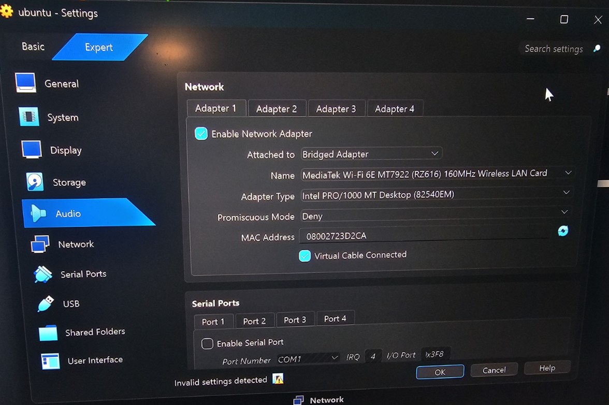
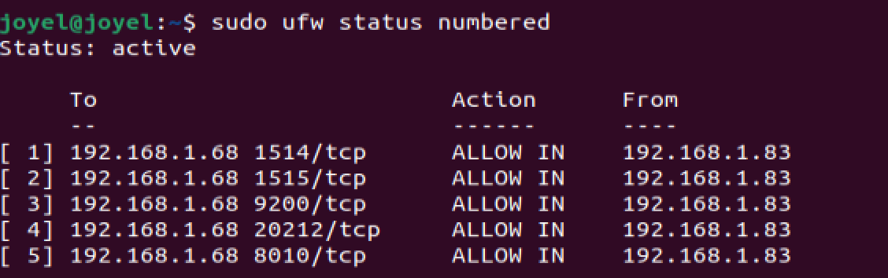
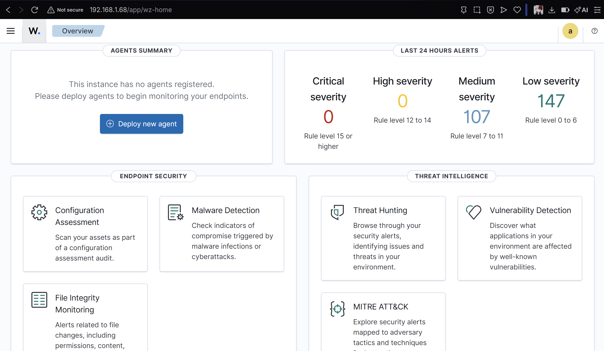
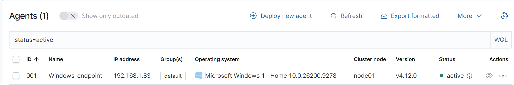
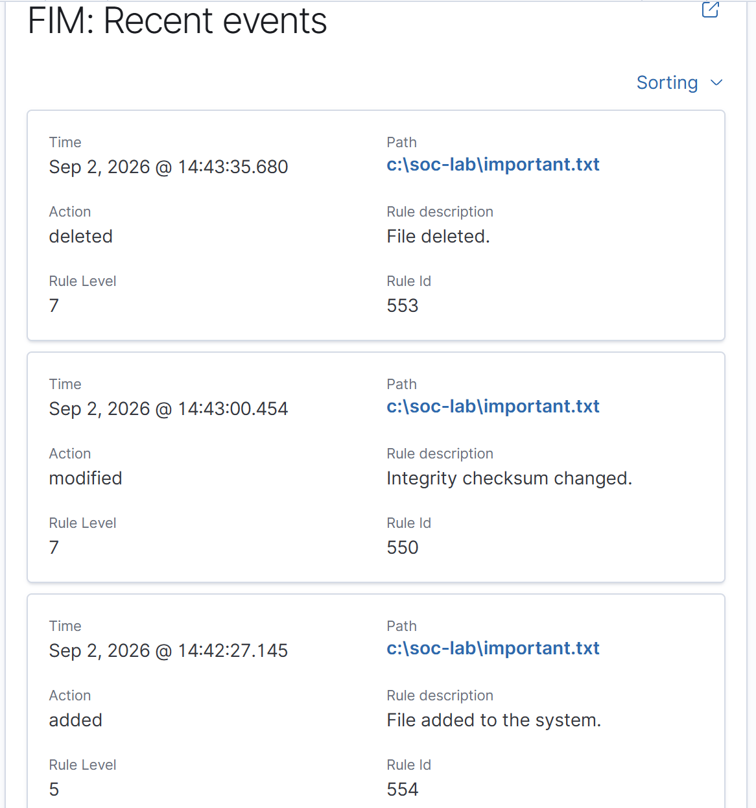
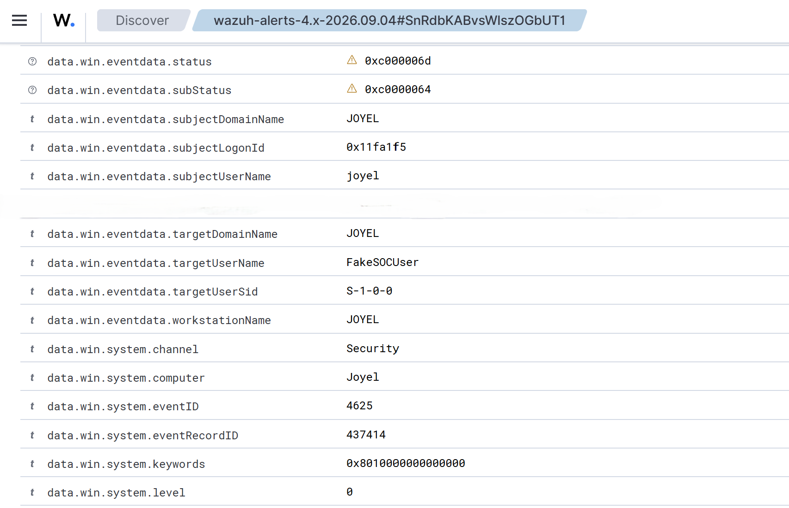
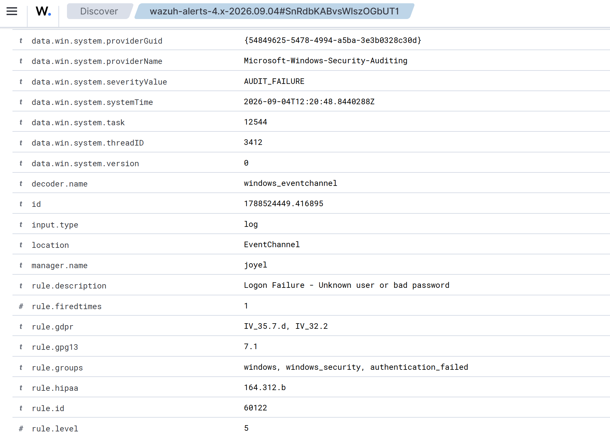

# Wazuh SIEM Home Lab

## Overview

This project documents the deployment of a home Security Operations Center (SOC) lab using Wazuh. The lab was designed to provide hands-on experience with SIEM deployment, endpoint monitoring, security event analysis, and alert investigation.

A Windows 11 endpoint was monitored using the Wazuh agent, while the Wazuh server components were hosted on an Ubuntu virtual machine. The environment was then used to generate and investigate security events, including failed Windows login attempts and file integrity changes.

## Project Objectives

- Build a functional SIEM environment using Wazuh.
- Monitor a Windows endpoint from a dedicated Ubuntu SOC server.
- Collect and analyse Windows security events.
- Configure File Integrity Monitoring (FIM).
- Detect and investigate failed authentication attempts.
- Apply basic network security and firewall rules between the systems.
- Gain practical experience investigating alerts using a SIEM.

## Lab Architecture

The lab consists of a Windows 11 host system and an Ubuntu virtual machine running in VirtualBox.

- **Windows 11 Endpoint** - Runs the Wazuh agent and generates security telemetry.
- **Ubuntu Server** - Hosts the Wazuh Manager, Wazuh Indexer, and Wazuh Dashboard.
- **VirtualBox** - Provides the virtualised environment for the Ubuntu SOC server.
- **Bridged Networking** - Allows the Ubuntu VM to communicate with the Windows host as a separate device on the local network.
- **UFW Firewall** - Restricts inbound connections to the required services and ports.

### Security Event Flow

Windows Security Events → Wazuh Agent → Wazuh Manager → Wazuh Indexer → Wazuh Dashboard

## Technologies Used

| Technology | Purpose |
|---|---|
| Wazuh | SIEM platform used for security monitoring, alerting, and event analysis |
| Windows 11 | Monitored endpoint and source of Windows security events |
| Ubuntu | Hosted the central Wazuh components |
| VirtualBox | Virtualisation platform used to host the Ubuntu VM |
| UFW | Host-based firewall used to restrict inbound network access |

## Network Configuration

The Ubuntu VM was configured using VirtualBox bridged networking. This allowed the VM to operate as a separate system on the local network and communicate directly with the monitored Windows endpoint.

UFW was configured using a default-deny approach for inbound traffic. Only ports required by the lab services were permitted.

Key Wazuh communication included:

- **TCP 1514** - Wazuh agent event communication.
- **TCP 1515** - Wazuh agent enrollment.
- **HTTPS 443** - Access to the Wazuh Dashboard.
- **TCP 9200** - Wazuh Indexer API access used during the wider lab.

## Wazuh Deployment

The Wazuh central components were deployed on the Ubuntu virtual machine. This provided a central platform for collecting, storing, analysing, and visualising security events generated by the monitored endpoint.

The Wazuh Dashboard provided a central interface for monitoring security events, viewing connected agents, and investigating generated alerts.

A Wazuh agent was installed on the Windows 11 endpoint and configured to communicate with the Wazuh Manager running on Ubuntu.

After enrollment, the endpoint appeared as an active agent within the Wazuh Dashboard, confirming successful communication between the Windows endpoint and the SIEM.

## Detection Testing

To verify that the SIEM was collecting and analysing security telemetry correctly, controlled security events were generated on the Windows endpoint.

### File Integrity Monitoring

Wazuh File Integrity Monitoring (FIM) was configured to monitor a test directory on the Windows endpoint.

A test file was created, modified, and deleted. Wazuh successfully generated alerts for each of these actions, demonstrating that changes to monitored files could be detected and investigated.

### Failed Login Detection

A controlled failed Windows login attempt was generated using a non-existent test account. Wazuh detected the authentication failure and generated an alert for investigation.

Further inspection of the alert provided additional information about the authentication failure, including the Windows security event and associated Wazuh rule.

## Skills Demonstrated

- SIEM deployment and configuration using Wazuh
- Windows endpoint security monitoring
- Security event and alert analysis
- File Integrity Monitoring (FIM)
- Windows authentication monitoring
- Basic SOC alert investigation
- Linux administration
- Virtual machine networking using VirtualBox
- Host-based firewall configuration using UFW
- Security testing and validation

## What I Learned

This project provided practical experience building and operating a small SIEM environment rather than only studying SIEM concepts theoretically.

I gained a better understanding of how endpoint security events are collected by an agent, analysed by a central manager, stored for investigation, and presented to an analyst through a SIEM dashboard.

Testing File Integrity Monitoring and failed authentication events also demonstrated the importance of validating security controls by generating known events and confirming that the expected alerts are produced.

## Future Improvements

Possible future extensions to the lab include:

- Expanding the environment with additional monitored endpoints.
- Adding an Active Directory environment for Windows domain security monitoring.
- Creating additional detection scenarios.
- Developing custom Wazuh detection rules.
- Adding automated alert enrichment and analysis.
